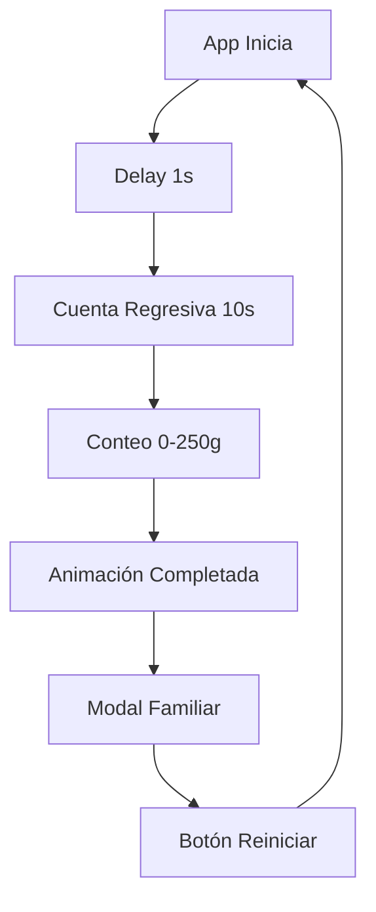

# 🐾 Smart Dog Bowl - Aplicación Móvil

**Contador Inteligente de Comida para Mascotas**

Una aplicación móvil desarrollada en React Native que simula un sistema inteligente de medición de comida para perros. Esta app representa el MVP de un plato inteligente que automatiza el proceso de alimentación y notifica a la familia cuando la mascota ha sido alimentada.


## 📱 Características Principales

### ✨ **Funcionalidades Core**
- **Inicio Automático**: La aplicación inicia el proceso de medición automáticamente tras 1 segundo
- **Cuenta Regresiva**: 10 segundos de preparación del "sensor" antes de iniciar
- **Medición Animada**: Contador de 0 a 250 gramos con animaciones fluidas
- **Progreso Visual**: Barra de progreso en tiempo real
- **Notificación Familiar**: Modal que simula el envío de notificaciones a la familia

### 🎨 **Experiencia de Usuario**
- **Diseño Moderno**: Interfaz oscura con colores vibrantes específicos para mascotas
- **Animaciones Suaves**: Transiciones y escalado del contador principal
- **Feedback Visual**: Estados claros y mensajes contextuales
- **Responsivo**: Diseño adaptable a diferentes tamaños de pantalla

## 🛠️ Tecnologías Utilizadas

### **Frontend Framework**
- **React Native 0.79.6**: Framework principal para desarrollo móvil multiplataforma
- **Expo ~53.0.22**: Plataforma de desarrollo que facilita el build y deployment

### **Lenguaje**
- **TypeScript ~5.8.3**: Superset de JavaScript con tipado estático
- **Interfaces y tipos personalizados**: Para mejor mantenibilidad y IntelliSense

### **Librerías Core**
- **React 19.0.0**: Biblioteca para interfaces de usuario
- **React Native Animated API**: Para animaciones nativas optimizadas
- **Expo Status Bar**: Control del status bar del dispositivo

### **Herramientas de Desarrollo**
- **Babel Core**: Transpilador de JavaScript
- **Metro Bundler**: Bundler optimizado para React Native

## 🏗️ Arquitectura y Estructura

### **Arquitectura Modular**
```
├── App.tsx                 # Componente principal y lógica de estado
├── components/             # Componentes reutilizables
│   ├── Header.tsx         # Encabezado de la aplicación
│   ├── Counter.tsx        # Contador principal con animaciones
│   ├── ProgressBar.tsx    # Barra de progreso
│   ├── ActionButton.tsx   # Botón de acción dinámico
│   ├── FamilyNotificationModal.tsx # Modal de notificación
│   └── index.ts           # Exportaciones centralizadas
├── types/                  # Definiciones de TypeScript
│   └── index.ts           # Interfaces y tipos
└── assets/                 # Recursos estáticos
```

### **Patrones de Diseño Implementados**
- **Component Composition**: Componentes pequeños y especializados
- **Props Interface**: Tipado fuerte para todas las propiedades
- **Custom Hooks**: useCallback para optimización de rendimiento
- **State Management**: Estados locales con React Hooks

## 🚀 Instalación y Ejecución

### **Prerrequisitos**
- Node.js (versión 16 o superior)
- npm o yarn
- Expo CLI
- Expo Go app en tu dispositivo móvil

### **Pasos de Instalación**

1. **Clonar el repositorio**
```bash
git clone https://github.com/tu-usuario/smart-dog-food-bowl-mobile.git
cd smart-dog-food-bowl-mobile
```

2. **Instalar dependencias**
```bash
npm install
```

3. **Ejecutar la aplicación**
```bash
npm start
```

4. **Probar en dispositivo**
- Escanea el QR code con la app Expo Go
- O ejecuta en simulador: `npm run ios` / `npm run android`

## 🎯 Flujo de la Aplicación



### **Estados de la Aplicación**
1. **`idle`**: Estado inicial, listo para comenzar
2. **`waiting`**: Cuenta regresiva de preparación (10s)
3. **`counting`**: Medición activa (0-250g)
4. **`completed`**: Proceso terminado, modal visible

## 🎨 Sistema de Diseño

### **Paleta de Colores**
- **Primary Orange**: `#FF6B35` - Elementos principales
- **Turquoise**: `#4ECDC4` - Acentos y progreso
- **Success Green**: `#27AE60` - Estados de éxito
- **Dark Background**: `#1E1E2E` - Fondo principal
- **Card Background**: `#2A2A3A` - Elementos elevados

### **Tipografía**
- **Counter**: 72px - Número principal del peso
- **Title**: 32px - Título de la aplicación
- **Status**: 18px - Estados del proceso
- **Progress**: 14px - Información secundaria

## 🔧 Escalabilidad y Futuras Funcionalidades

### **Arquitectura Escalable**
La aplicación está diseñada como un **MVP (Minimum Viable Product)** con capacidad de crecimiento:

#### **🔌 Integración IoT**
- **Sensores Reales**: Conexión con báscula inteligente via Bluetooth/WiFi
- **Arduino/ESP32**: Integración con hardware para medición real
- **MQTT Protocol**: Comunicación en tiempo real con dispositivos

#### **📊 Funcionalidades Avanzadas**
```typescript
// Ejemplos de nuevas features
interface FutureFeatures {
  profiles: PetProfile[];        // Múltiples mascotas
  schedule: FeedingSchedule[];   // Horarios automáticos
  history: FeedingHistory[];     // Historial de alimentación
  analytics: NutritionData;      // Análisis nutricional
  notifications: PushNotif[];    // Notificaciones reales
  camera: FoodDetection;         // Reconocimiento de alimentos
}
```

#### **🌐 Backend Integration**
- **API REST**: Para sincronización de datos
- **Real-time Database**: Firebase/Supabase para datos en tiempo real
- **Cloud Storage**: Historial y perfiles en la nube
- **Push Notifications**: Notificaciones reales a la familia

#### **👥 Funcionalidades Sociales**
- **Multi-Usuario**: Cuentas familiares compartidas
- **Veterinario Integration**: Conectar con profesionales
- **Community Features**: Compartir logros y consejos

### **Tecnologías de Escalamiento**
- **State Management**: Redux Toolkit para estados complejos
- **Navigation**: React Navigation para múltiples pantallas
- **Offline Support**: Redux Persist + AsyncStorage
- **Testing**: Jest + Testing Library para pruebas
- **CI/CD**: GitHub Actions para deployment automático

## 📈 Rendimiento y Optimización

### **Optimizaciones Implementadas**
- **useCallback**: Previene re-renders innecesarios
- **Animated API**: Animaciones ejecutadas en UI thread
- **Component Memoization**: React.memo en componentes puros
- **TypeScript**: Detección temprana de errores

### **Métricas de Performance**
- **Tamaño del Bundle**: ~2-3 MB (optimizable)
- **Tiempo de Carga**: <2 segundos en dispositivos medios
- **Fluidez**: 60 FPS en animaciones
- **Memoria**: <50 MB de uso en runtime

## 🧪 Testing Strategy

### **Testing Implementado**
- **Linting**: ESLint para calidad de código
- **Type Checking**: TypeScript para verificación de tipos

### **Testing Futuro**
```bash
# Unit Tests
npm run test:unit

# Integration Tests  
npm run test:integration

# E2E Tests
npm run test:e2e
```

## 📝 Contribuir

### **Guidelines de Desarrollo**
1. **Seguir la estructura modular** establecida
2. **Usar TypeScript** para todas las nuevas funcionalidades
3. **Mantener componentes pequeños** y especializados
4. **Documentar interfaces** y funciones complejas
5. **Probar en múltiples dispositivos** antes de hacer PR

### **Workflow de Contribución**
```bash
git checkout -b feature/nueva-funcionalidad
# Desarrollar cambios
git commit -m "feat: agregar nueva funcionalidad"
git push origin feature/nueva-funcionalidad
# Crear Pull Request
```

## 📄 Licencia

Este proyecto está bajo la Licencia MIT. Ver el archivo `LICENSE` para más detalles.

## 👥 Equipo

Desarrollado como prototipo de aplicación IoT para alimentación inteligente de mascotas.

---

### 🐕 "Porque cada mascota merece la mejor alimentación, y cada familia merece estar tranquila" 

**Smart Dog Bowl** - Transformando la experiencia de cuidado de mascotas a través de la tecnología.
